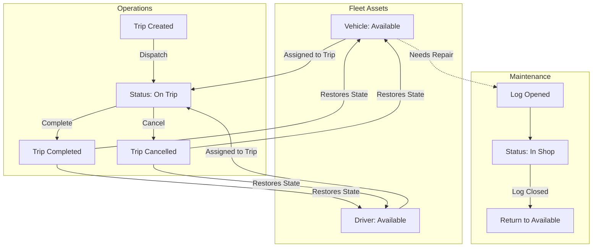

<div align="center">
  <!-- Using a live animated GIF from Tenor so it works immediately -->
  

  <h1>🚀 TransitOps: Smart Transport Operations Platform</h1>

  <p>
    <em>Like a reliable Log Pose navigating the unpredictable seas of the New World, TransitOps guides your fleet's journey—replacing chaotic spreadsheets with an automated, synchronized, and robust operational platform.</em>
  </p>

  <p align="center">
    
    
    
    <br/>
    
    
    
    
  </p>
</div>

---

## ⚓ The Problem & The Solution

<details>
<summary><b>❌ The Era of Spreadsheet Operations (Click to expand)</b></summary>
<br>
Managing fleets through manual spreadsheets leads to:
<ul>
  <li>Double-booked vehicles and drivers.</li>
  <li>Missed maintenance schedules leading to breakdowns.</li>
  <li>Dispatching drivers with expired licenses.</li>
  <li>Untracked operating costs and scattered fuel receipts.</li>
</ul>
</details>

<details open>
<summary><b>✅ The TransitOps Solution</b></summary>
<br>
TransitOps acts as a centralized source of truth. Vehicle and driver states are wired together across every module. 
<strong>The system enforces business rules automatically</strong>, rather than relying on a human to remember them.
</details>

---

## 🌊 Core Workflows & Architecture

The heartbeat of TransitOps is its state machine. Dispatching, maintaining, and retiring assets are strictly controlled.



### ⚙️ Tech Stack Deep Dive
* **Frontend Application (`/frontend`)**: A blazing fast SPA built with **React** & **Vite**. Styled beautifully using **Tailwind CSS**, with **Recharts** driving the analytical dashboards. Served in production via **Nginx**.
* **Backend API (`/backend`)**: A robust REST API powered by **FastAPI** & **Python**. 
* **Database & ORM**: **PostgreSQL** acts as the reliable data vault. **SQLAlchemy** manages the ORM layer, and **Alembic** seamlessly handles schema migrations.
* **Security**: JWT-based authentication with strict Role-Based Access Control (RBAC) and bcrypt-hashed passwords.

---

## 🗺️ Role-Based Access Control

Everyone has a part to play on the crew. The platform tailors access based on role:

| Role | Responsibility |
|:---|:---|
| 👑 **Fleet Manager** | Oversees fleet assets, maintenance, and the full vehicle lifecycle. |
| 🚙 **Driver** | Creates trips, monitors deliveries, and oversees active dispatching. |
| 🛡️ **Safety Officer** | Tracks license validity, safety scores, and blocks unsafe dispatches. |
| 💰 **Financial Analyst** | Reviews expenses, logs fuel costs, and computes profitability/ROI. |

---

## 🚀 Getting Started

Set sail in just a few commands using Docker.

### Prerequisites
* Docker & Docker Compose
* Node.js 18+ (For local frontend dev)
* Python 3.11+ (For local backend dev)

### The One-Command Launch (Recommended)
```bash
# Build and run the entire stack (Database, Backend, Frontend, Nginx)
docker-compose up --build
```
> The application will be live at `http://localhost:5173` (or port `80` if using the production proxy).

<details>
<summary><b>🛠️ Local Development Setup (Without Docker Compose)</b></summary>
<br>

**1. Start Postgres in Docker**
```bash
docker-compose up postgres
```

**2. Start Backend**
```bash
cd backend
cp .env.example .env
pip install -r requirements.txt
alembic upgrade head
uvicorn app.main:app --reload
```

**3. Start Frontend**
```bash
cd frontend
npm install
npm run dev
```
</details>

---

## 📂 Project Structure

```text
transitops/
├── backend/
│   ├── app/
│   │   ├── api/v1/routes/      # Endpoints (auth, vehicles, trips, reports)
│   │   ├── models/             # SQLAlchemy DB schemas
│   │   ├── schemas/            # Pydantic request/response validation
│   │   ├── services/           # Decoupled business logic
│   │   └── core/               # Security, DB connections, and config
│   ├── alembic/                # DB Migrations
│   └── tests/                  # Pytest suite
├── frontend/
│   ├── src/
│   │   ├── api/                # Axios interceptors & HTTP calls
│   │   ├── components/         # Reusable UI (Cards, Modals, Badges)
│   │   ├── features/           # Domain-specific logic
│   │   └── context/            # Global state (Auth, Theme)
│   └── nginx.conf              # SPA routing rules for production
└── docker-compose.yml          # Container orchestration
```

---

<div align="center">
  <p>Built with 🩵 for the Odoo Hiring Hackathon.</p>
</div>
